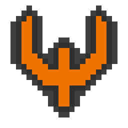

<p><br></p>

<p align="center"></p>

<p><br></p>

<h1 align="center">
  QIDE - The (Q)uake Mod (IDE)<p><br><p>
  <a href="https://github.com/RamblingMadMan/qide#About">About</a> - 
  <a href="https://github.com/RamblingMadMan/qide#Getting-It">Getting It</a> - 
  <a href="https://github.com/RamblingMadMan/qide#Screenshots">Screenshots</a>
  <p><br></p>
</h1>

 

<p><br></p>

# About

QIDE aims to lower the barrier to entry for newcomers to QuakeC and make Quake modding more easily accessable to a wider audience.

The project currently targets compatibility with the 2021 re-release.

<p><br></p>

## Features

| Status | Feature | Description |
| :---: | :----- | :----- |
|  ✅  | Automatic setup | Automatically find Quake (or use built-in shareware) and download [FTEQW](https://fte.triptohell.info/) if needed. |
|  ✅  | Integrated compiler | [Modified version of GMQCC](https://github.com/RamblingMadMan/gmqcc) built-in. |
|  ✅  | Separate work and data directories | QIDE keeps your source and Quake directories clean. |
|  ✅  | Launch from editor | Launch Quake with your mod enabled, directly from the editor. |
|  ❓  | Syntax/Semantic Highlighting | Highlight QuakeC files. |
|  ❓  | In-built map editor | Edit maps with pausable live gameplay. |
|  ❌  | QuakeC debugging | Debug your mods in real-time. |
|  ❌  | QuakeC VM | Test out simple QuakeC snippets and integrate them with native code. |

<p><br></p>

# Getting It

There are currently no versioned releases of QIDE and it is in active development with many things changing and possibly breaking.

That said, for the keen and able (use linux) there are automatically built AppImages available.

<p><br></p>

## Autobuilds

Automatic builds are available for linux in AppImage format.
They are a work in progress themselves, but will be most up-to-date functionality wise.

[Download the latest AppImage here](https://github.com/RamblingMadMan/qide/releases/tag/autobuild)

<p><br></p>

## Building

The build process is pretty similar to other CMake based projects, and should be fairly straightforward.

<p><br></p>

### Getting the source

```bash
git clone --depth 1 https://github.com/RamblingMadMan/qide.git
```

<p><br></p>

### Dependencies

- C++20 compiler
- [CMake](https://cmake.org/)
- Qt5 Widgets

<p><br></p>

#### Ubuntu 20.04+

First it is recommended you enable the [toolchain test builds ppa](https://launchpad.net/~ubuntu-toolchain-r/+archive/ubuntu/test) for the more recent compiler versions.
To enable it run the following commands:

```bash
sudo add-apt-repository ppa:ubuntu-toolchain-r/test
sudo apt update
```

Then to install all of the build dependencies run the following command:

```bash
sudo apt install g++-11 cmake qtbase5-dev qtbase5-dev-tools libzip-dev libglm-dev
```

You also may need to set GCC 11 as your default compiler with the following commands:

```bash
sudo update-alternatives --install /usr/bin/gcc gcc /usr/bin/gcc-11 10
sudo update-alternatives --install /usr/bin/g++ g++ /usr/bin/g++-11 10
sudo update-alternatives --install /usr/bin/cc cc /usr/bin/gcc 30
sudo update-alternatives --install /usr/bin/c++ c++ /usr/bin/g++ 30
sudo update-alternatives --set cc /usr/bin/gcc
sudo update-alternatives --set c++ /usr/bin/g++
```

<p><br></p>

#### Windows 10

It is recommended to use the latest version of MSVC, usually installed alongside Visual Studio.

The easiest way to build the project is to install [Qt Creator](https://www.qt.io/product/development-tools), open it there and hit build.

> When installing Qt make sure to install Qt 5.15.x

<p><br></p>

### Compiling

From the root directory of the repo run the following commands:

```bash
mkdir build
cd build
cmake .. -DCMAKE_BUILD_TYPE=RelWithDebInfo
cmake --build . -- -j8
```

Now there should be a folder `build/qide` with the compiled executable inside.

<p><br></p>

# Screenshots

<p align="center"></p>
<p align="center"></p>

<p><br></p>

# Special Thanks

Thank you to all of the people involved in all of the projects that made QIDE possible.

Projects used:

- [FTEQW](https://fte.triptohell.info/)
- [GMQCC](https://graphitemaster.github.io/gmqcc/)
- [glbinding](https://github.com/cginternals/glbinding)
- [rapidfuzz-cpp](https://github.com/maxbachmann/rapidfuzz-cpp)
- [{fmt}](https://github.com/fmtlib/fmt)
- [glm](https://github.com/g-truc/glm)
- [UTF8-CPP](https://github.com/nemtrif/utfcpp)
- [Source Sans font](https://github.com/adobe-fonts/source-sans)
- [Hack font](https://github.com/source-foundry/Hack)
- [Monoid font](https://github.com/larsenwork/monoid)
- [Eva icons](https://github.com/akveo/eva-icons)
